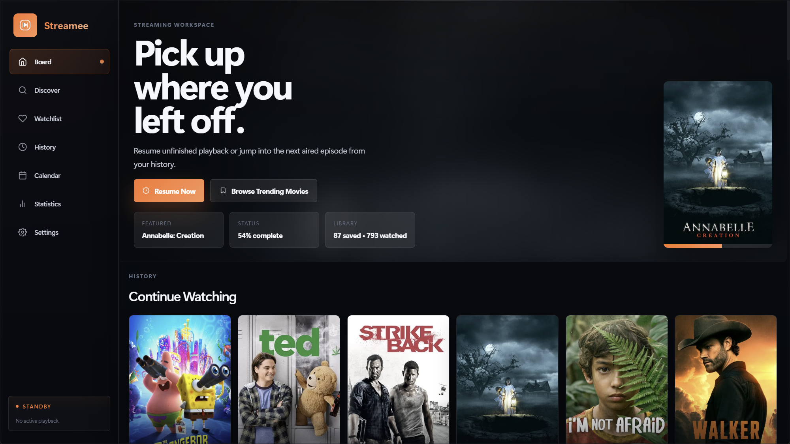
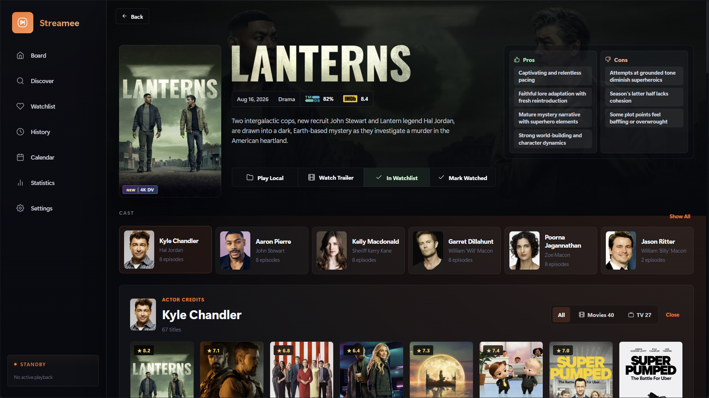
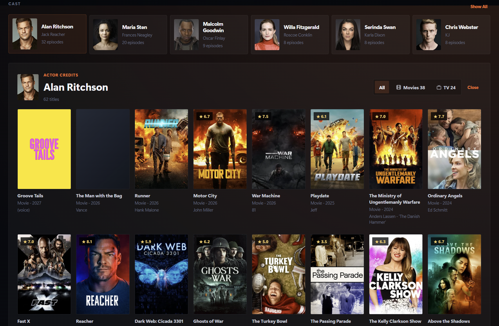
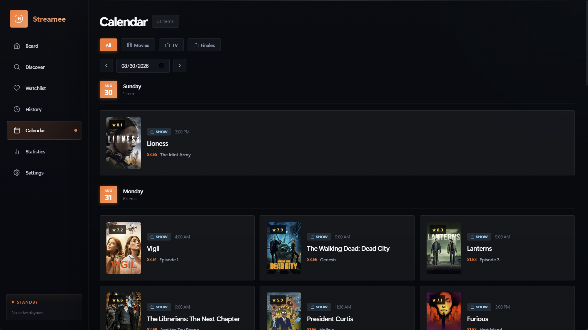
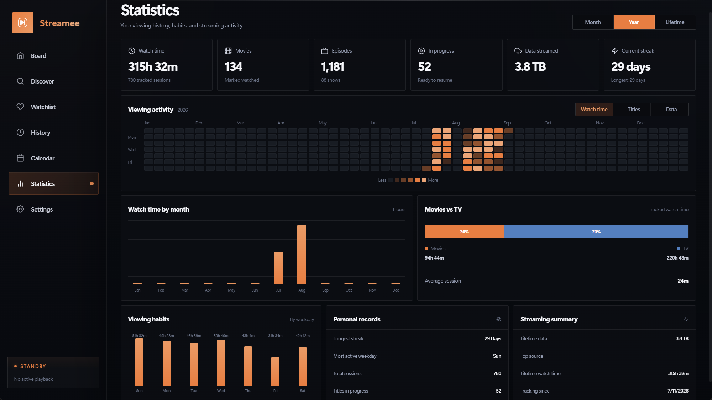
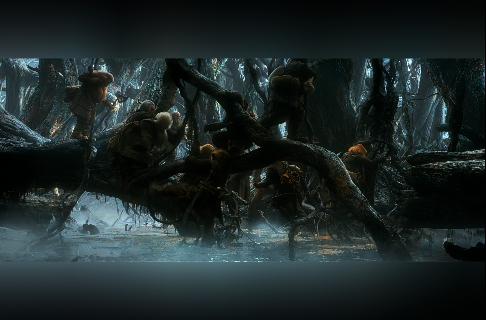
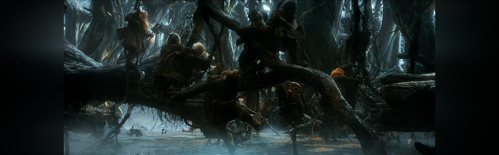

# Streamee

A Windows desktop media application for discovering movies and TV shows and playing user-authorized sources through MPV.

[](https://github.com/StreameeApp/Streamee-app/releases/latest)


Streamee combines a polished discovery library with a highly tuned desktop playback stack. Metadata comes from established catalog services, sources come from add-ons that the user chooses and configures, and playback stays under the user's control through the bundled MPV player.

> [!IMPORTANT]
> Streamee does not include media, source-provider accounts, or preconfigured stream add-ons. Install only services you trust and play only media you are authorized to access.

## Screenshots





## Highlights

- Rich movie and TV discovery backed by TMDB, with optional OMDb ratings and Trakt sync
- User-installed, Stremio-compatible source add-ons with secure URL storage and ordered fallback
- Bundled MPV playback anchored to the Streamee window
- Local, real-time WhisperLive subtitle generation with CPU and CUDA support
- Automatic intro and recap skipping, outro-aware next-episode playback, and local detection fallbacks
- Smart Next preparation that can warm the next aired episode before the current one ends
- A real-time LUFS-based Audio Normalizer with adaptive gating, gain riding, and final peak protection
- Configurable upscaling, sharpening, denoising, debanding, HDR handling, Smart Black Bar Fill with optional edge lighting, and optional SVP integration
- Direct playback of local video files and folders through the same MPV experience
- Cache-only seekbar thumbnails, reusable stream caching, playback statistics, and a local phone remote

## Features

### Discovery and metadata

- **Board** — Continue Watching, watchlist rows, trending titles, recommendations, and other personalized entry points.
- **Catalogs** — Browse popular and trending movies and series, plus anticipated Trakt catalogs when connected.
- **Search and filters** — Search titles or actors, browse Trakt lists, and narrow results by media type, genre, year, language, rating, and sort order.
- **Anime filtering** — Show all titles, only Japanese-language animation, or exclude it from discovery without hiding personal library entries.
- **Detailed title pages** — Posters, backdrops, summaries, directors, cast and actor credits, trailers, ratings, release information, regional streaming availability, and season/episode browsers.
- **Release context** — Optional xREL and srrDB metadata helps interpret release names and quality details without supplying playable media.
- **TMDB + OMDb** — Managed TMDB access powers the main catalog and artwork without requiring a personal key; OMDb can supplement it with IMDb ratings and extra details.



### Library, Trakt, and statistics

- **Watchlist and history** — Save titles, track completed playback, and return to previously watched media.
- **Continue Watching** — Resume movies and episodes from their saved position.
- **Trakt integration** — Connect with an authorization code to sync watchlist and history and improve board recommendations. Streamee manages its own Trakt application credentials.
- **TV Calendar** — See upcoming episodes from followed and watchlisted series in a weekly view.
- **Viewing statistics** — Inspect watch time, completed titles, streamed data, activity heatmaps, movie-versus-TV totals, weekday habits, streaks, session counts, and lifetime summaries.

<table>
  <tr>
    <td></td>
    <td></td>
  </tr>
  <tr>
    <td align="center"><em>Upcoming episodes in the TV Calendar</em></td>
    <td align="center"><em>Viewing history, habits, and streaming activity</em></td>
  </tr>
</table>

### MPV playback built into the desktop experience

Streamee bundles MPV and launches it as a dedicated playback surface anchored to the application window. The player follows the app as it moves or resizes, while Streamee maintains playback state, progress, selected tracks, and episode transitions through MPV IPC.

Playback helpers include:

- Preferred audio and subtitle languages, with SRT and SDH preferences
- Resume progress, playlists, audio/subtitle track popovers, playback speed, and fullscreen control
- Local video-file and folder playback, including multi-file MPV playlists
- Direction-aware previous/next episode navigation that preserves queued playlist behavior and can request an earlier or later episode when needed
- Seekbar preview thumbnails generated only from bytes already present in the local cache; hovering never starts a separate upstream transfer
- Optional stereo downmix for headphones or systems that incorrectly negotiate multichannel layouts
- Optional Discord Rich Presence using clean movie or episode titles rather than source filenames
- A debug overlay with playback and transfer telemetry
- External-player protocol support for VLC, MPC-HC, and MPC-BE

### WhisperLive subtitle generation

WhisperLive provides progressive subtitles when a source has no suitable subtitle track, or whenever the user explicitly chooses local transcription.

- Audio is extracted during playback and streamed to a local WhisperLive server, so subtitle generation can begin without waiting for the complete media file.
- Transcription runs locally through `faster-whisper`/CTranslate2 after the runtime and model are installed.
- **Auto** selects CUDA when a compatible GPU is available and falls back to CPU; CPU-only and forced-CUDA modes are also available.
- Models range from Tiny through Large v3, with Turbo offered as the recommended low-latency option for live subtitles.
- Generated segments are loaded into MPV as playback progresses.
- Whisper follows the currently selected audio track and restarts transcription when that track changes.
- Automatic fallback, always-use-Whisper, manual retry, runtime testing, and repair controls are built into Settings.

WhisperLive requires `ffmpeg` on `PATH`. The first run of a model may take longer while it is downloaded and loaded.

### Automatic intros, recaps, outros, and Smart Next

Streamee treats segment skipping conservatively because an incorrect automatic seek is worse than leaving a segment untouched.

- It first checks duration-matched community timestamps for intros, recaps, and outros. Conflicting data is rejected instead of guessed.
- Named chapters are used as an immediate local fallback when available.
- When enabled and community data is missing, the local Intro Skipper compares audio fingerprints across episodes using only bytes already verified in Streamee's cache. It never opens a future queued episode merely to analyze it.
- Detection is scoped to the selected audio variant so fingerprints from different languages or tracks are not mixed.
- Local tail analysis can use repeated audio and strong end-of-file visual credit patterns as conservative outro signals.
- Intro and recap behavior can be set independently to **Always watch**, **Watch once per series session**, or **Always skip**.
- At a verified outro, Streamee can advance an already queued episode or request Smart Next. If no next source is ready, the credits continue normally.
- **Autoload Smart Next** begins preparing the next aired episode at 70% playback and warms only its opening—up to 10% of the episode, capped at 1 GB—for a faster, state-preserving handoff.
- Detected intro, recap, and outro ranges are shown directly on the MPV seekbar so automatic decisions remain visible.

### Audio Normalizer: a loudness rider, not a volume preset

Conventional normalization commonly applies one fixed gain value to an entire track, or compresses everything through the same static curve. That can leave dialogue inconsistent, raise quiet background noise, or make loud scenes feel flat. Streamee instead runs a continuously measured loudness rider inside MPV:

1. MPV's EBU R128 analysis reports momentary, short-term, and integrated loudness alongside true-peak measurements.
2. A slow control path follows programme loudness toward a configurable LUFS target using bounded attack and release rates.
3. Silence gating holds the current gain when meaningful programme audio is absent, preventing pauses and noise floors from being boosted.
4. The adaptive gate can learn the separation between ambient and foreground levels instead of relying only on one fixed threshold.
5. Optional fast, transient, and peak-ceiling stages react to sudden loud events without forcing the slow rider to pump.
6. A final look-ahead limiter protects the processed output from clipping. Surround audio is downmixed before this protection stage so the downmix cannot create a new unguarded peak.

The rider changes its own MPV audio-filter gain, not the user's MPV or Windows volume setting. Low, Medium, High, and Custom modes cover everyday use, while the tuner exposes live LUFS, gain, gate, true-peak, limiter-reduction, filter-state, and event telemetry.

This approach is especially useful for dialogue-heavy viewing and large scene-to-scene loudness changes: it can lift sustained quiet material gradually, preserve intentional dynamics, stop adapting during silence, and still protect the final output.

### Video processing

Streamee exposes a configurable MPV processing chain rather than locking playback to one rendering profile:

- **Upscaling** — NVIDIA RTX Video Super Resolution, SSimSuperRes, or FSR.
- **HDR** — Detect HDR/Dolby Vision release metadata, enable Windows HDR on the playback monitor, optionally restore it on exit, and support RTX Video HDR for SDR-to-HDR conversion.
- **Sharpening** — Standard, Adaptive, Ultra, and UltraCustom presets, plus automatic source-aware selection.
- **Denoising** — Bilateral and advanced MPV/VapourSynth processing with selectable strength and GPU-oriented BM3D modes where supported.
- **Debanding** — Optional MPV debanding for visible color gradients.
- **Smart Black Bar Fill** — Detects embedded black bars and fits the active picture to displays of any aspect ratio. It handles side bars on ultrawide displays and top/bottom bars on standard displays without moving soft subtitles or player controls. Independent **Black Bar Lighting** extends averaged edge colours into unused space even when fill detection is off; disabling lighting keeps smooth fixed-canvas cropping with black surroundings. Settings provide saved defaults, while the MPV right-click menu can override both features for the current title.
- **Efficient aspect detection** — **Efficient** scans briefly at playback start, after seeking, and periodically. **Dynamic** follows aspect-ratio changes using a low-resolution, reduced-frame-rate lookahead probe. When Smart Black Bar Fill is active, duplicate SVP lighting is suppressed only for the current playback pipeline so SVP does not render an unnecessarily enlarged intermediate frame; SVP's generated source script and global settings remain unchanged.
- **Season-aware settings** — Player-menu processing changes can carry through later episodes of the same season without becoming a global default.
- **SVP integration** — Start, restart, and close SmoothVideo Project with playback, and control whether RTX VSR runs before or after frame interpolation.

#### Smart Black Bar Fill and edge lighting

Smart Black Bar Fill adapts playback to both standard and ultrawide displays, while optional edge lighting extends scene colours into otherwise unused screen space.



*Top and bottom unused space on a standard display.*



*Side-space handling on an ultrawide display.*

Hardware-specific features require compatible drivers, displays, and third-party runtimes.

### Streaming cache and source transport

- Remote sources are presented to MPV through local backend services, allowing consistent seeking, cancellation, progress reporting, Whisper access, and cache policy.
- Sparse range caching prioritizes the current playback position instead of requiring a complete file before playback.
- The optional full-file mode continues filling toward the end while retaining already downloaded ranges on disk.
- Persistent caching can reuse remote-stream data across sessions and evicts the oldest inactive entries when its configurable size limit is reached.
- With persistence disabled, streaming caches are disposable and removed automatically.
- Opening ranges can be retained for Smart Next and local segment analysis without allowing those helpers to compete freely with active playback.

### Phone remote

Enable a lightweight remote-control page for phones on the same trusted local network. It shows the active title, timeline, connection state, and queue, and can control:

- Play/pause, seeking, previous/next, and playlist items
- MPV volume and Windows system volume
- Audio tracks, subtitle tracks, speed, and fullscreen
- HDR, SVP, Audio Normalizer restart, and on-demand Whisper subtitles

The remote is served only while enabled. It is intended for a trusted private network; other devices on that network may be able to control playback.

## How stream add-ons work

Streamee supports the stream portion of the Stremio add-on protocol. An add-on is an independent web service that maps a standard movie or series identifier to source descriptors. Streamee is the client and player—it does not operate, mirror, or curate the add-on's service.

The flow is deliberately simple:

1. **Configure the service** — The user visits an add-on's own website, chooses any account or source options there, and copies the resulting manifest URL.
2. **Install the manifest** — Streamee validates the manifest and records its declared media types and stream capability.
3. **Request sources** — When the user opens a movie or episode, Streamee sends its standard content identifier to enabled add-ons in the user's chosen priority order.
4. **Use the first useful response** — An add-on may return an HTTP(S) stream or a protocol descriptor such as an info hash and file index. Streamee converts supported results into its common source list and can fall through to the next installed add-on when a higher-priority service is unavailable or returns no usable results.
5. **Play locally** — After the user selects a result, Streamee's backend prepares the source for MPV and applies the same playback, cache, subtitle, and telemetry pipeline used elsewhere in the app.

### Add-on security and privacy boundaries

- Configured manifest URLs may contain private service configuration, so the complete URL is stored in **Windows Credential Manager**, never `localStorage`, frontend state, repository files, or normal logs.
- The React frontend stores only non-secret manifest metadata and an opaque credential reference.
- Direct stream URLs returned by an add-on are replaced with short-lived opaque handles before results reach the frontend. The backend resolves them only when playback is prepared.
- Remote add-ons must use HTTPS. Plain HTTP is accepted only for an explicitly local loopback service.
- Configured manifest URLs containing embedded HTTP credentials, redirects, oversized JSON responses, invalid manifests, unexpected media identifiers, and remote add-on hosts that resolve to private or unsafe network addresses are rejected.
- Add-ons can be enabled, disabled, tested, removed, and reordered. Their order defines automatic fallback priority.

These controls reduce accidental credential exposure and unsafe network access, but they do not certify an add-on or the media it returns. Add-ons remain independent third-party services. Users are responsible for trusting the service, following its terms, and ensuring they have permission to access each selected source.

## Getting started

### Requirements

- Windows 10 or Windows 11
- `ffmpeg` on `PATH` only when using WhisperLive
- Optional: an OMDb API key, Trakt account, compatible source add-ons, NVIDIA RTX features, or SVP

MPV and TMDB catalog access are bundled or managed by Streamee; no personal TMDB key is required.

### First-time setup

1. Review **Settings → Providers & Accounts** and optionally choose a streaming region, connect Trakt, or add an OMDb key.
2. Optionally configure a trusted, lawful source add-on on its own website, then install its manifest under **Settings → Stream Add-ons**. Local files and folders can be played without an add-on.
3. Choose subtitle, audio, cache, and playback preferences.
4. Browse to a title, select a source you are authorized to play, or choose **Play Local**.

## Keyboard shortcuts

| Key | Action |
| --- | --- |
| `D` | Toggle the in-app playback debug overlay |
| `N` | Open the Audio Normalizer tuner |

MPV also provides its standard playback shortcuts and Streamee-specific on-screen controls.

## Development

```bash
npm install
npm run dev          # Frontend-only Vite server
npm run tauri:dev    # Full desktop development workflow
npm run build        # TypeScript and Vite production build
npm test             # TypeScript service and behavior tests
npm run version:bump # Explicitly bump synchronized application versions
npm run tauri:build  # Clean MPV staging plus Windows installer build
```

The desktop application is built with Tauri 2.x, Rust, React 18, TypeScript, Zustand, and Vite. MPV handles playback; Rust services manage application commands, secure add-on access, local proxies, caching, WhisperLive orchestration, remote control, and Windows integration. A Node.js sidecar provides WebTorrent transport for supported user-supplied protocol sources.

## Project structure

```text
src/
├── renderer/                  React application
│   ├── features/              Board, catalog, metadata, player, settings, and statistics
│   ├── services/              TMDB, Trakt, add-ons, source search, Smart Next, and telemetry
│   └── store/                 Zustand application state
└── ...
src-tauri/
├── src/                       Rust backend and local services
├── remote/                    Phone remote web application
└── resources/                 Bundled runtime resources
mpv/
├── scripts/                   Streamee MPV integrations
└── shaders/                   Video-processing shaders
```

## Responsible use

Streamee is a general-purpose media discovery and playback client. It is designed for local files, personal media, public-domain works, freely licensed media, and remote sources that the user is authorized to access. The project does not bundle content, accounts, add-ons, or instructions for bypassing access controls.

## License

Streamee is licensed under the GNU General Public License, version 3 or later. See [LICENSE](LICENSE) for the full terms.
